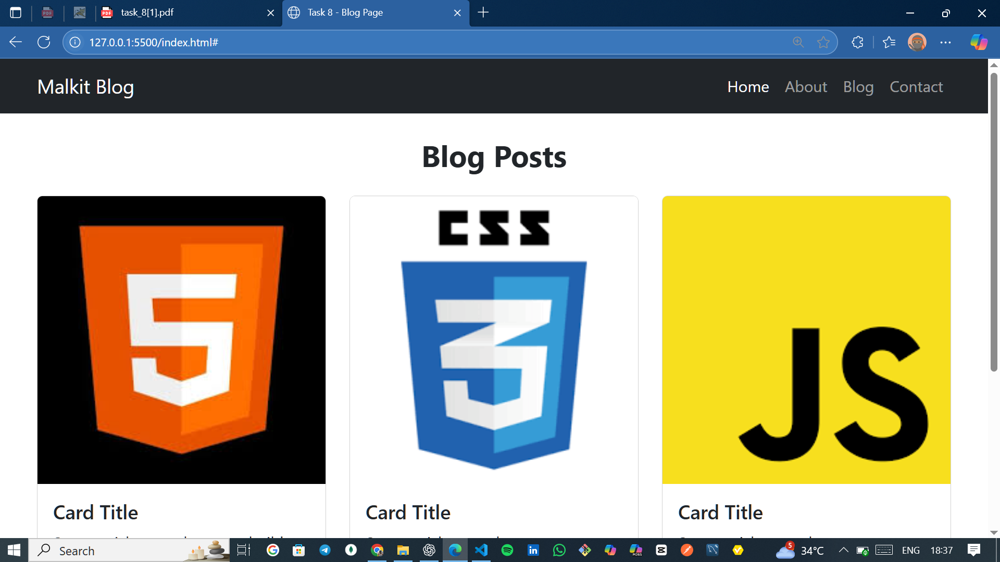

# Task 8 - Responsive Blog Page (Bootstrap)

This project is part of my **Web Development Internship at Elevate Labs**.  
The task was to create a **responsive blog page** using **Bootstrap 5**.

## 🚀 Features
- Responsive **Navbar** with toggle menu for mobile devices
- **Blog post cards** with images, titles, descriptions, and "Read More" buttons
- Fully **responsive grid layout** using Bootstrap's `.row` and `.col` classes
- **Footer** with copyright text and social media icons
- Minimal custom CSS for styling

## 🛠️ Technologies Used
- **HTML5**
- **CSS3**
- **Bootstrap 5.3.7**
- **Bootstrap Icons**

## 📂 Folder Structure
# Task 8 - Responsive Blog Page (Bootstrap)

This project is part of my **Web Development Internship at Elevate Labs**.  
The task was to create a **responsive blog page** using **Bootstrap 5**.

## 🚀 Features
- Responsive **Navbar** with toggle menu for mobile devices
- **Blog post cards** with images, titles, descriptions, and "Read More" buttons
- Fully **responsive grid layout** using Bootstrap's `.row` and `.col` classes
- **Footer** with copyright text and social media icons
- Minimal custom CSS for styling

## 🛠️ Technologies Used
- **HTML5**
- **CSS3**
- **Bootstrap 5.3.7**
- **Bootstrap Icons**

## 📂 Folder Structure
│── index.html # Main HTML file
│── style.css # Custom CSS styles
│── README.md # Project documentation


## 📸 Screenshot


## 📌 How to Run
1. Clone this repository:
   ```bash
   git clone https://github.com/your-username/task-8-bootstrap-blog.git
